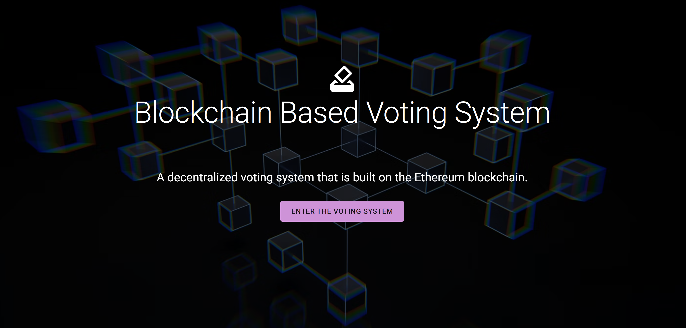
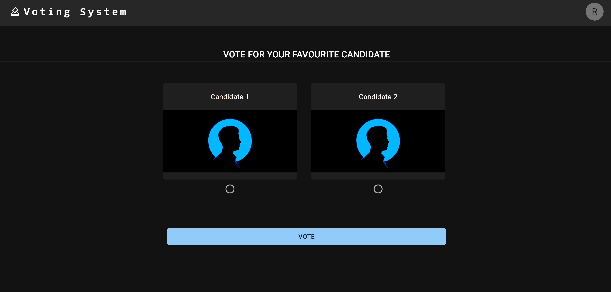
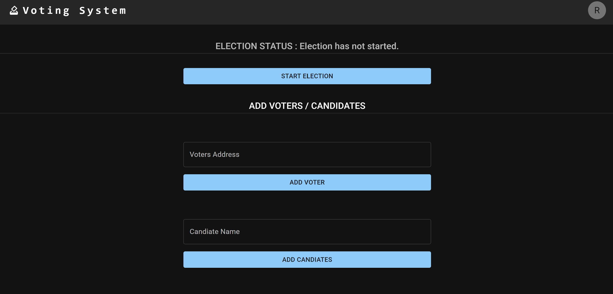

# Block-Chain Based Voting System

This project is blockchain based voting dapp created in React and Solidity.

## Project Description

“Blockchain Based Voting System” is a web based online voting system primarily based on ethereum blockchain technology. Blockchain is a transparent, distributed, immutable and trustless ledger and to overcome the problems of the traditional voting system, blockchain plays a vital role in terms of security, trust and more. Here anyone eligible for voting can vote for their favorite candidate and they can see the result after the end of the election. It is fast, secure, and has low cost as compared to traditional voting systems. Some key features of our system are:

a) Decentralized & Transparent

b) Trustless

c) Immutable

This project is a simple implementation of a voting system done to understand the basics of ethereum blockchain technology and the working mechanism of decentralized application made in Solidity and React. Here, one account who deploys the smart contract is the Admin and he/she can add voters and candidates that are eligible to cast the vote.  Then, the admin starts the election and eligible voters can vote for their favorite candidate. Finally, when admin ends the election, the voters can immediately see the final result of the election.

## Screenshots

 &nbsp;
 &nbsp;
 &nbsp;

## Installation

### Step 1. Clone the project

```git clone https://github.com/ashishlamsal/voting-dapp```

### Step 2. Start Ganache

Open the Ganache GUI client to start the local blockchain instance.

### Step 3. Compile & Deploy Election Smart Contract

```truffle migrate --reset```

We must migrate the election smart contract each time restart ganache.

### Step 4. Configure Metamask

- Unlock Metamask
- Connect metamask to the local Etherum blockchain provided by Ganache.
- Import an account provided by Ganache.

### Step 5. Run the Front End Application

```powershell
cd .\client
yarn install
yarn start
```

Visit URL in your browser: <http://localhost:3000>

## Next Steps

- Better legitimate user checking through biometrics
- Better voters and candidate data insertion
- Multiple candidate positions for voting

## Note

This project is not intended to be a fully fledged voting system. It is just a proof of concept to understand the basics of blockchain technology. It is done as a final project of Blockchain Fellowship 2022 by [esatya.io](https://esatya.io/fellowship/2021).